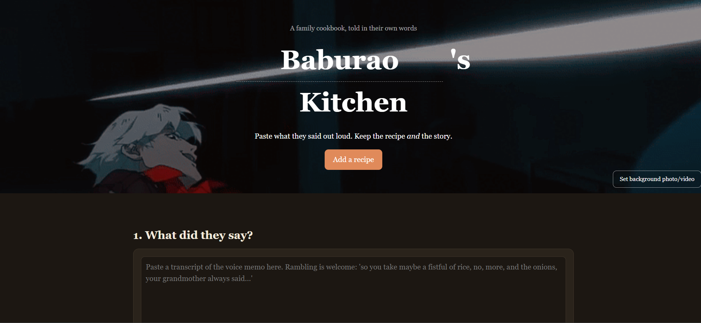

# Recipe Keeper

Turn a loved one's rambling voice memos into a printable family cookbook, using an open-weight AI model that runs **entirely on your own computer**.

Built for **[name, e.g. my grandfather]** for the [Hacktoberfest Weekend Challenge: Build for a Friend](https://dev.to/challenges/hacktoberfest-weekend-2026-10-01).




## Why this exists

Some people cook by feel: "a fistful of rice, no, more, and onions until it smells right." Nothing is written down, and those recipes are lost if nobody captures them. Ordinary recipe apps demand exact measurements and throw away the stories.

Recipe Keeper keeps both. You paste what the person said, and a local model turns it into a clean recipe card while keeping their original words underneath.

## Features

- **Memo to recipe card:** title, intro, ingredients, steps and notes, streamed live as the model writes.
- **Never invents quantities:** "a fistful" stays "a fistful". Unclear parts become `Ask <name>: ...` notes so you know what to ask them next.
- **Keeps their words:** every card shows a quote of the original memo.
- **Media slots:** a photo or video background for the hero section, and a photo slot on every recipe.
- **Print or save as PDF:** a print stylesheet makes the cookbook ready to give as a gift.
- **Backup:** export and import the whole cookbook as JSON, and copy any recipe as Markdown.
- **Private by design:** no account, no API key, no server. Data lives in your browser's local storage.

## Requirements

- [Ollama](https://ollama.com)
- At least one model, for example `llama3.2` (about 2 GB)
- A modern browser
- Python 3 (only for the easiest setup option)

## Quick start

### 1. Install Ollama and pull a model

```bash
ollama pull llama3.2
```

This needs internet once. After that everything works offline. Check what you already have with `ollama list`.

### 2. Get the app

```bash
git clone https://github.com/<your-username>/recipe-keeper.git
cd recipe-keeper
```

### 3. Let the page talk to Ollama

Ollama only accepts requests from pages it trusts. Pick **one** option.

**Option A: serve from localhost (easiest, no settings to change)**

```bash
python -m http.server 8000
```

Then open <http://localhost:8000/recipe-keeper.html>.

**Option B: open the file directly**

Quit Ollama first (check the system tray or menu bar), then start it allowing all origins.

macOS / Linux:

```bash
OLLAMA_ORIGINS="*" ollama serve
```

Windows (PowerShell):

```powershell
$env:OLLAMA_ORIGINS="*"; ollama serve
```

Then double-click `recipe-keeper.html`. Keep the terminal open while you use the app.

### 4. Use it

1. Check that the status dot is **green** and your model shows in the dropdown.
2. Change "Grandpa" in the title to whoever the recipes belong to.
3. Paste a transcript of the voice memo and click **Turn into recipe**.
4. Add a photo of the dish, then print the cookbook.

> **Tip:** to transcribe audio without leaving your machine, use [whisper.cpp](https://github.com/ggerganov/whisper.cpp). Or just type it out together.

## Troubleshooting

| Problem | Fix |
|---|---|
| Dot is red: "Cannot reach Ollama" | Open <http://localhost:11434>. If it says "Ollama is running", the problem is permission, so use Option A or B above. If the page doesn't load, start Ollama. |
| Dot is green but the dropdown is empty | You haven't pulled a model yet. Run `ollama pull llama3.2`. |
| "Address already in use" | Ollama is already running in the background. Quit it, then start it again with `OLLAMA_ORIGINS`. |
| "Model output was not valid JSON" | Try again, or choose a larger model. Small models occasionally break the format. |
| Photos stop saving | Browser storage is full. Export a backup and remove some photos. |

## How it works

- A single HTML file with plain JavaScript. No build step and no dependencies.
- Calls Ollama's local API (`/api/tags` to list models, `/api/chat` to generate) and streams the response.
- Uses JSON mode (`format: "json"`) with a low temperature so the output is a structured recipe.
- The system prompt tells the model to use only what was said, keep the speaker's personality, and flag anything unclear instead of guessing.
- Recipes are stored in `localStorage`. Photos are resized in the browser before saving.

## Why open source AI?

- **Privacy:** family stories and voices never leave the machine.
- **Offline:** works with no internet after the model is downloaded.
- **Free:** no API keys and no per-token cost.
- **Swappable:** switch models from the dropdown, or fine-tune one later so the cards sound like the cook.
- **Controllable:** the "never invent quantities" behavior is a prompt and settings I own, not a provider's policy.

## Roadmap

- [ ] Whisper integration so voice memos go in directly
- [ ] "Read it back aloud" mode
- [ ] Multiple cooks and a family tree view
- [ ] Translation for recipes told in another language

## Contributing

Issues and pull requests are welcome, especially for new languages and kitchen-friendly layouts.

---

Made with love for **[name]**.
